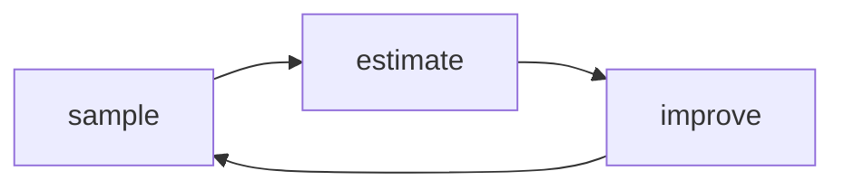

# 6. 提升智能体的行为

## 强化学习的结构
- 大多数智能体通过收集采样经验（experience sample）学习
- 大多数智能体估计某些东西（多种值函数）
- 大多数智能体试图提升策略（policy）  



### 多数智能体收集采样经历
- 强化学习智能体通过试错学习。（trail-and-error）
- **如何采集数据（经验）是独立于学习之外的挑战**
- 标准的强化学习从和环境的交互中获取经历。这里的环境指的是试图解决的问题。
- 相比于监督学习，强化学习通过交互产生数据集。
- **如何选择数据集也是一个挑战**
- 强化学习通常解决交互学习问题（interactive learning problems）

### 多数智能体会做某些估计
- 智能体会预测期望回报或者其他值函数。例如：Monte-Carlo(every-visit or first-visit),TD,n-step,λ-return
- 智能体还能被设计为学习环境模型。从数据中学习环境模型——转移函数和奖励函数。
- 智能体同样能被设计为能直接利用估计回报提升策略。例如策略梯度方法（policy gradient methods）
- **智能体大多数情况下会做某些估计**

#### 回顾——Monte-Carlo 和 Temporal-Difference
- 可以用不同的方法去估计价值函数（value functions）
- 通用范式为：
  $$estimate_{'} = estimate+ step \times error$$
  $$error = target-estimate$$
- 两种主要且相对的计算target方法为：蒙特卡洛和时间差分学习
- 蒙特卡洛(monte-carlo)估计是由实际回报组成。通过经验均值回报替代期望回报来调整值函数估计。类似于用频率近似概率。
- 时间差分(temporal-difference)一种自举法(bootstrapping)由估计回报组成。由之前估计的期望回报来估算当前状态的期望回报。使用一个reward加上下一个状态的估计的期望回报。下一个状态的估计期望回报通过正在计算的状态值来估算。


### 多数智能体会提升策略
- **多数智能体会提升一个策略。**而提升的方式取决于被训练的智能体的类型和智能体估计的是哪种值函数。
- **目标策略(target policy)**，目标策略被隐式的编码到了价值函数里，表示当前被学习的策略。
- **行为策略(behavior policy)**，目标策略的改善使得行为策略随之提高。行为策略体现了数据生成策略，因此提高了智能体随后采集的数据质量。
- 当目标策略和行为策略相同时，潜在的价值函数提高会明显的提高随后数据生成的质量。**当达到目标策略时，可以获取到符合目标策略的数据**
- 如果策略是以非价值函数直接表达的，例如策略梯度（policy gradient）或者actor-critic方法，智能体将使用实际回报提升这些策略。同事，智能体也能利用价值函数估计回报提升这些策略（间接优化提升）
- 对于基于模型的强化学习，提升策略有多种选择。有用学习到的环境模型规划一序列的动作，规划阶段隐含的提高了策略;可以使用模型学习一个价值函数，这将潜在的包含一个策略；或者，直接利用模型提升策略。
- **所有的智能体都会试图提升一个策略**
- 通用范式：有不同的**策略估计**和**策略提升**阶段，必要的只是在每个阶段挑选合适的方法。

### 通用策略迭代（Generalized policy iteration）
GPI的整体思路是通过不断的执行策略估计和策略提升来使得策略向着最优前进。

**通用策略迭代范式：**
- 策略估计，通常包含收集（gathering）和估计（estimating）价值函数（value functions）
- 策略提升，由改变一个策略使其就价值函数而言更贪婪（greedier）组成

## 利用学习提高行为策略
### monte carlo 控制(每个回合（episode）结束之后提升策略)
- 需要等到回合结束之后才能计算提高策略

- $V(s)$只表示了某个状态的价值。在没有MDP的情况下，不能直接得到对应最优状态的动作。因此需要估计 $Q(s,a)$

- 需要保持探索。由于没有MDP，只能从采样中估计策略——得到每个采样得到的状态-动作对的值，但是不能保证最优的状态-动作对被访问到了。

- 核心逻辑:

  1. 蒙特卡洛预测(monte carlo prediciton):应对策略估计阶段。**估计预测价值函数，可以是状态值函数也可以是动作值函数**

  2. 带衰减的epsilon-greedy 动作筛选策略（action-selection strategy）：应对策略提升阶段。**主要是为了策略提升提供新的样本（sample）。** 由于带有衰减，所以探索的概率会随衰减发生变化。

同样的，该方法也可以使用值迭代的思路。可以截断（truncate）蒙特卡洛预测方法。
- 不同于策略迭代思路的运行多个回合（episode），值迭代思路值运行**一个回合**，之后直接提高策略。
- 即值迭代方法下，算法的步骤为：一次蒙特卡洛预测，一次带衰减的epsilon-greedy 动作选择的提升。

### SARSA方法（在每一步之后提高策略）

- 估计动作值函数
- 在最优动作值函数的基础上，取argmax

- 利用时序差分预测（temporal-difference）

### Q-learning 方法

核心方法和SARA类似，但在迭代target时所用的策略有所不同(Decoupling behavior from learning)

#### SARA和Q-learning 代码对比

代码对比：

- SARA

```python
def sarsa(env,
          gamma=1.0,
          init_alpha=0.5,
          min_alpha=0.01,
          alpha_decay_ratio=0.5,
          init_epsilon=1.0,
          min_epsilon=0.1,
          epsilon_decay_ratio=0.9,
          n_episodes=3000):
    nS, nA = env.observation_space.n, env.action_space.n
    pi_track = []
    Q = np.zeros((nS, nA), dtype=np.float64)
    Q_track = np.zeros((n_episodes, nS, nA), dtype=np.float64)
    select_action = lambda state, Q, epsilon: np.argmax(Q[state]) \
        if np.random.random() > epsilon \
        else np.random.randint(len(Q[state]))
    alphas = decay_schedule(init_alpha, 
                           min_alpha, 
                           alpha_decay_ratio, 
                           n_episodes)
    epsilons = decay_schedule(init_epsilon, 
                              min_epsilon, 
                              epsilon_decay_ratio, 
                              n_episodes)
    
    for e in tqdm(range(n_episodes), leave=False):
        state, done = env.reset(), False
        action = select_action(state, Q, epsilons[e])
        while not done:
            next_state, reward, done, _ = env.step(action)
            next_action = select_action(next_state, Q, epsilons[e])
            td_target = reward + gamma * Q[next_state][next_action] * (not done)
            ## Q[next_state][next_action]中next_action 来自 select_action方法，也即e-greedy
            td_error = td_target - Q[state][action]
            Q[state][action] = Q[state][action] + alphas[e] * td_error
            state, action = next_state, next_action
        Q_track[e] = Q
        pi_track.append(np.argmax(Q, axis=1))

    V = np.max(Q, axis=1)
    pi = lambda s: {s:a for s, a in enumerate(np.argmax(Q, axis=1))}[s]
    return Q, V, pi, Q_track, pi_track
```

- Q-learning

```python
def q_learning(env, 
               gamma=1.0,
               init_alpha=0.5,
               min_alpha=0.01,
               alpha_decay_ratio=0.5,
               init_epsilon=1.0,
               min_epsilon=0.1,
               epsilon_decay_ratio=0.9,
               n_episodes=3000):
    nS, nA = env.observation_space.n, env.action_space.n
    pi_track = []
    Q = np.zeros((nS, nA), dtype=np.float64)
    Q_track = np.zeros((n_episodes, nS, nA), dtype=np.float64)
    select_action = lambda state, Q, epsilon: np.argmax(Q[state]) \
        if np.random.random() > epsilon \
        else np.random.randint(len(Q[state]))
    alphas = decay_schedule(init_alpha, 
                           min_alpha, 
                           alpha_decay_ratio, 
                           n_episodes)
    epsilons = decay_schedule(init_epsilon, 
                              min_epsilon, 
                              epsilon_decay_ratio, 
                              n_episodes)
    for e in tqdm(range(n_episodes), leave=False):
        state, done = env.reset(), False
        while not done:
            action = select_action(state, Q, epsilons[e])
            next_state, reward, done, _ = env.step(action)
            td_target = reward + gamma * Q[next_state].max() * (not done)
            ## Q[next_state].max()表示了Q[next_state][max_value_action]
            td_error = td_target - Q[state][action]
            Q[state][action] = Q[state][action] + alphas[e] * td_error
            state = next_state

        Q_track[e] = Q
        pi_track.append(np.argmax(Q, axis=1))

    V = np.max(Q, axis=1)        
    pi = lambda s: {s:a for s, a in enumerate(np.argmax(Q, axis=1))}[s]
    return Q, V, pi, Q_track, pi_track
```


###  Double Q-learning

#### Q-learning的缺点

- Q-learning 容易高估价值函数的结果。主要是因为对**动作值函数下一个状态的估计**的最大值。而实际需要的是**动作值函数下一个状态的实际**的最大值。
- 同时，由于Q-learning使用了自举（bootstrapping）方法进行估计。这样的结果通常是有偏的（biased）。**使用有偏估计的最大值作为最大值**，这一类问题被称为最大化偏差(maximaization bias)问题

#### Double Q-learing

- 处理最大化偏差问题，可以使用两个动作值函数估计方程$Q_1,Q_2$, $Q_1$计算下一个状态的动作，$Q_2$计算下一状态和动作的估计。
- 与环境交互的动作选择两个动作函数的均值或者和，在给定的状态下的最大值。即$ Q_1(S_{t+1})+Q_2(S_{t+1})$或$(Q_1(S_{t+1})+Q_2(S_{t+1}))/2$

```python
def double_q_learning(env,
                      gamma=1.0,
                      init_alpha=0.5,
                      min_alpha=0.01,
                      alpha_decay_ratio=0.5,
                      init_epsilon=1.0,
                      min_epsilon=0.1,
                      epsilon_decay_ratio=0.9,
                      n_episodes=3000):
    nS, nA = env.observation_space.n, env.action_space.n
    pi_track = []
    Q1 = np.zeros((nS, nA), dtype=np.float64)
    Q2 = np.zeros((nS, nA), dtype=np.float64)
    Q_track1 = np.zeros((n_episodes, nS, nA), dtype=np.float64)
    Q_track2 = np.zeros((n_episodes, nS, nA), dtype=np.float64)
    select_action = lambda state, Q, epsilon: np.argmax(Q[state]) \
        if np.random.random() > epsilon \
        else np.random.randint(len(Q[state]))
    alphas = decay_schedule(init_alpha, 
                           min_alpha, 
                           alpha_decay_ratio, 
                           n_episodes)
    epsilons = decay_schedule(init_epsilon, 
                              min_epsilon, 
                              epsilon_decay_ratio, 
                              n_episodes)
    for e in tqdm(range(n_episodes), leave=False):
        state, done = env.reset(), False
        while not done:
            action = select_action(state, (Q1 + Q2)/2, epsilons[e])
            next_state, reward, done, _ = env.step(action)

            if np.random.randint(2):
                argmax_Q1 = np.argmax(Q1[next_state])
                td_target = reward + gamma * Q2[next_state][argmax_Q1] * (not done)
                td_error = td_target - Q1[state][action]
                Q1[state][action] = Q1[state][action] + alphas[e] * td_error
            else:
                argmax_Q2 = np.argmax(Q2[next_state])
                td_target = reward + gamma * Q1[next_state][argmax_Q2] * (not done)
                td_error = td_target - Q2[state][action]
                Q2[state][action] = Q2[state][action] + alphas[e] * td_error
            state = next_state

        Q_track1[e] = Q1
        Q_track2[e] = Q2        
        pi_track.append(np.argmax((Q1 + Q2)/2, axis=1))

    Q = (Q1 + Q2)/2.
    V = np.max(Q, axis=1)    
    pi = lambda s: {s:a for s, a in enumerate(np.argmax(Q, axis=1))}[s]
    return Q, V, pi, (Q_track1 + Q_track2)/2., pi_track   
```

