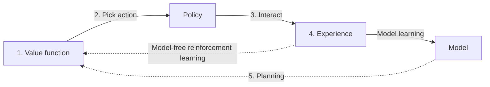

# 7.更有效的完成目标

学习利用鲁棒性的目标提升策略

### SARSA($\lambda$)

- 使用$\lambda$-return替代SARSA中的单步自举(one-step bootstrapping)


### 资格迹(eligibility trace)

#### 累积迹(accumulating trace)

- 改进第4章中的资格迹，追踪访问过的**状态**改进成访问过的**状态动作对**
- 从资格向量(eligibility vector)转变到资格矩阵(eligibility matrix)
- 随着$\lambda$衰减
- 累计迹是有偏的

#### 替换迹(replacing trace)

- 每次访问state时，将所有该state对应的state-action置为0。 见code 41行。
- 从对资格迹的值**不设限**到将**最大值设为1**，避免陷入循环的时候资格值超过比例。
- 同样随着$\lambda$衰减
- 比累计迹要更快更可靠
- 替换迹是无偏的

TD(1)和替换迹，与first-visit MC 相关

TD(1)和累计迹，与every-visit MC相关


```python
def sarsa_lambda(env,
                 gamma=1.0,
                 init_alpha=0.5,
                 min_alpha=0.01,
                 alpha_decay_ratio=0.5,
                 init_epsilon=1.0,
                 min_epsilon=0.1,
                 epsilon_decay_ratio=0.9,
                 lambda_=0.5,
                 replacing_traces=True,
                 n_episodes=3000):
    nS, nA = env.observation_space.n, env.action_space.n
    pi_track = []
    Q = np.zeros((nS, nA), dtype=np.float64)

    Q_track = np.zeros((n_episodes, nS, nA), 
                       dtype=np.float64)
    E = np.zeros((nS, nA), dtype=np.float64)
    select_action = lambda state, Q, epsilon: \
        np.argmax(Q[state]) \
        if np.random.random() > epsilon \
        else np.random.randint(len(Q[state]))
    alphas = decay_schedule(
        init_alpha, min_alpha, 
        alpha_decay_ratio, n_episodes)
    epsilons = decay_schedule(
        init_epsilon, min_epsilon, 
        epsilon_decay_ratio, n_episodes)
    
    for e in tqdm(range(n_episodes), leave=False):
        E.fill(0)

        state, done = env.reset(), False
        action = select_action(state, Q, epsilons[e])
        while not done:
            next_state, reward, done, _ = env.step(action)
            next_action = select_action(next_state, Q, epsilons[e])

            td_target = reward + gamma * Q[next_state][next_action] * (not done)
            td_error = td_target - Q[state][action]
            if replacing_traces: E[state].fill(0)
            E[state][action] = E[state][action] + 1
            if replacing_traces: E.clip(0, 1, out=E)
            Q = Q + alphas[e] * td_error * E
            E = gamma * lambda_ * E
            
            state, action = next_state, next_action

        Q_track[e] = Q
        pi_track.append(np.argmax(Q, axis=1))

    V = np.max(Q, axis=1)
    pi = lambda s: {s:a for s, a in enumerate(np.argmax(Q, axis=1))}[s]
    return Q, V, pi, Q_track, pi_track
```

### Watkins's Q($\lambda$)

- 将行为和学习解耦。行为策略和目标策略（学习中的策略）不同。也即，**off-policy**离线策略。
- Q($\lambda$)是Q-learning 利用$\lambda$-return一个扩展。Q($\lambda$)利用$\lambda$-return和Q-learning来实现通用策略迭代范式。
- 将TD target换成下Q[next_state].max()。这一步表现**off-policy**性
- 有两种实现方式，本书中挑选了原始版本。被称为 watkins's Q($\lambda$)
- 注意code 36， code45~48.

```python
def q_lambda(env,
             gamma=1.0,
             init_alpha=0.5,
             min_alpha=0.01,
             alpha_decay_ratio=0.5,
             init_epsilon=1.0,
             min_epsilon=0.1,
             epsilon_decay_ratio=0.9,
             lambda_=0.5,
             replacing_traces=True,
             n_episodes=3000):
    nS, nA = env.observation_space.n, env.action_space.n
    pi_track = []
    Q = np.zeros((nS, nA), dtype=np.float64)
    Q_track = np.zeros((n_episodes, nS, nA), dtype=np.float64)
    E = np.zeros((nS, nA), dtype=np.float64)
    select_action = lambda state, Q, epsilon: \
        np.argmax(Q[state]) \
        if np.random.random() > epsilon \
        else np.random.randint(len(Q[state]))
    alphas = decay_schedule(
        init_alpha, min_alpha, 
        alpha_decay_ratio, n_episodes)
    epsilons = decay_schedule(
        init_epsilon, min_epsilon, 
        epsilon_decay_ratio, n_episodes)
    
    for e in tqdm(range(n_episodes), leave=False):
        E.fill(0)
        state, done = env.reset(), False
        action = select_action(state, Q, epsilons[e])
        while not done:
            next_state, reward, done, _ = env.step(action)
            next_action = select_action(next_state, Q, epsilons[e])
            
            next_action_is_greedy = Q[next_state][next_action] == Q[next_state].max()

            td_target = reward + gamma * Q[next_state].max() * (not done)
            td_error = td_target - Q[state][action]
            if replacing_traces: E[state].fill(0)
            E[state][action] = E[state][action] + 1
            if replacing_traces: E.clip(0, 1, out=E)
            Q = Q + alphas[e] * td_error * E
            
            if next_action_is_greedy:
                E = gamma * lambda_ * E
            else:
                E.fill(0)

            state, action = next_state, next_action

        Q_track[e] = Q
        pi_track.append(np.argmax(Q, axis=1))

    V = np.max(Q, axis=1)        
    pi = lambda s: {s:a for s, a in enumerate(np.argmax(Q, axis=1))}[s]
    return Q, V, pi, Q_track, pi_track
```

## 交互，学习和规划的智能体

- 规划算法：值迭代和策略迭代。需要环境的MDP模型
- 无模型算法：mc,sarsa,Q-learning,sarsa($\lambda$),Q($\lambda$)。无需MDP模型。
- 基于模型算法：通过交互对环境建模，学习MDP模型。学习需要相对较少的交互经验（数据）
- 值迭代和策略迭代同样可以认为是基于模型的算法。

本书中：

- 规划算法指完全依赖MDP进行运作的算法。
- 无模型的算法指不需要且不学习MDP模型的算法。
- 基于模型的算法指不需要，但实际学习和利用了MDP的算法。

### 采样模型和分布模型

- 采样模型：指在给定某一概率的前提下，生成环境转移的一个样本的环境模型。
- 分布模型：指生成转移和奖励函数概率分布的环境模型。

### Dyna-Q: 学习采样模型

- 一种出名的统一规划和无模型方法的架构。

- 交替使用无模型方法和规划方法。通过从**环境采集的经验**和学习的**模型中采样的经验**来提高动作值函数。

- 使用常见的Q-learning，加上少量的规划迭代（planning iterations）。

- 将转移函数和奖励函数看作一个三维张量（three-dimensional tensor）

  - ```python
    TransitionFunc[state][action][next_state]
    #表示从state + action --> next_state 的次数
    ```

  - ```python
    RewardFunc[state][action][next_state] = avg_reward
    #表示从state + action --> next_state 的奖励的平均值/期望奖励
    ```

- **模型中采样阶段**
  - 仅使用访问过的state-action。避免对无信息的state-action对浪费资源。code 48，code 52
  - 均匀随机采样state,action。根据采样的state-action的转移概率采样next_state。code 49, code 53



1. 基于模型学习，随机一个值函数(动作值)。
2. 根据值函数选择一个动作。
3. 在环境中执行一个动作，并从环境中得到一个反馈（response）/ 经验（experience）
4. 根据经验，更新值函数和环境模型。
5. 利用环境模型进一步提高值函数(动作值)。

```python
def dyna_q(env,
           gamma=1.0,
           init_alpha=0.5,
           min_alpha=0.01,
           alpha_decay_ratio=0.5,
           init_epsilon=1.0,
           min_epsilon=0.1,
           epsilon_decay_ratio=0.9,
           n_planning=3,             
           n_episodes=3000):
    nS, nA = env.observation_space.n, env.action_space.n
    pi_track, T_track, R_track, planning_track = [], [], [], []
    Q = np.zeros((nS, nA), dtype=np.float64)
    T_count = np.zeros((nS, nA, nS), dtype=np.int)
    R_model = np.zeros((nS, nA, nS), dtype=np.float64)

    Q_track = np.zeros((n_episodes, nS, nA), dtype=np.float64)
    select_action = lambda state, Q, epsilon: \
        np.argmax(Q[state]) \
        if np.random.random() > epsilon \
        else np.random.randint(len(Q[state]))
    alphas = decay_schedule(
        init_alpha, min_alpha, 
        alpha_decay_ratio, n_episodes)
    epsilons = decay_schedule(
        init_epsilon, min_epsilon, 
        epsilon_decay_ratio, n_episodes)
    
    for e in tqdm(range(n_episodes), leave=False):
        state, done = env.reset(), False
        while not done:
            action = select_action(state, Q, epsilons[e])
            next_state, reward, done, _ = env.step(action)

            T_count[state][action][next_state] += 1
            r_diff = reward - R_model[state][action][next_state]
            R_model[state][action][next_state] += (r_diff / T_count[state][action][next_state])# 根据增量表达式

            td_target = reward + gamma * Q[next_state].max() * (not done)
            td_error = td_target - Q[state][action]
            Q[state][action] = Q[state][action] + alphas[e] * td_error

            backup_next_state = next_state
            #记录实际的next_state,因为n_planning循环会更改next_state
            for _ in range(n_planning):
                if Q.sum() == 0: break

                visited_states = np.where(np.sum(T_count, axis=(1, 2)) > 0)[0]
                state = np.random.choice(visited_states)
                # 随机从已经访问的(s,a,s')中选择状态

                actions_taken = np.where(np.sum(T_count[state], axis=1) > 0)[0]
                action = np.random.choice(actions_taken)
                # 随机从已经访问的(s,a,s')中选择动作

                probs = T_count[state][action]/T_count[state][action].sum()
                #求（s,a）的转移概率
                next_state = np.random.choice(np.arange(nS), size=1, p=probs)[0]
             	# 为了随机生成一个（s,a,s'）
                reward = R_model[state][action][next_state]
                planning_track.append((state, action, reward, next_state))
                # 上面几步是从环境模型采样一个模拟样本    
                
                #利用估计模型的生成样本提升Q
                td_target = reward + gamma * Q[next_state].max()
                td_error = td_target - Q[state][action]
                Q[state][action] = Q[state][action] + alphas[e] * td_error

            state = backup_next_state

        T_track.append(T_count.copy())
        R_track.append(R_model.copy())
        Q_track[e] = Q        
        pi_track.append(np.argmax(Q, axis=1))

    V = np.max(Q, axis=1)
    pi = lambda s: {s:a for s, a in enumerate(np.argmax(Q, axis=1))}[s]
    return Q, V, pi, Q_track, pi_track, T_track, R_track, np.array(planning_track)
```

### 轨迹采样：为不久的将来（immediate future）制定计划

Dyna-Q的缺点： 算法**基于模型规划的阶段**使用均匀随机采样生成state效率比较低。该采样策略缺少对状态的“针对性”。 **但其采样概率能更好的反应MDP**

- **基于模型规划的阶段**采样的state要更符合事件发生的频率。
- planning for immediate future指的是对不久的将来更容易遇到的情况规划。
- **轨迹采样（trajectory sampling）**就是一种符合上述要求的基于模型的强化学习方法。
  - 采集轨迹，即在不久的将来能遇到的转移和奖励。**而不是** Dyna-Q那样**随机均匀采样**。
  - 传统的轨迹采样方法：从初始状态开始采样，直到中止状态。使用在线策略（on-policy）轨迹。换而言之，从相同的行为策略，在给定time step下采样action。
  - 本书中：从当前状态开始采样到给定步长内的中止状态（from current state to a terminal state within a preset number of steps）同时，就当前的估计**贪婪地**采样一个策略（sampling a policy greedy with respect to the current estimates）。
  - **能更好的反应reward**

```python
def trajectory_sampling(env,
                        gamma=1.0,
                        init_alpha=0.5,
                        min_alpha=0.01,
                        alpha_decay_ratio=0.5,
                        init_epsilon=1.0,
                        min_epsilon=0.1,
                        epsilon_decay_ratio=0.9,
                        max_trajectory_depth=100,
                        planning_freq=5,
                        greedy_planning=True,
                        n_episodes=3000):
    nS, nA = env.observation_space.n, env.action_space.n
    pi_track, T_track, R_track, planning_track = [], [], [], []
    Q = np.zeros((nS, nA), dtype=np.float64)
    T_count = np.zeros((nS, nA, nS), dtype=np.int)
    R_model = np.zeros((nS, nA, nS), dtype=np.float64)

    Q_track = np.zeros((n_episodes, nS, nA), dtype=np.float64)
    select_action = lambda state, Q, epsilon: \
        np.argmax(Q[state]) \
        if np.random.random() > epsilon \
        else np.random.randint(len(Q[state]))
    alphas = decay_schedule(
        init_alpha, min_alpha, 
        alpha_decay_ratio, n_episodes)
    epsilons = decay_schedule(
        init_epsilon, min_epsilon, 
        epsilon_decay_ratio, n_episodes)

    for e in tqdm(range(n_episodes), leave=False):
        state, done = env.reset(), False

        while not done:
            action = select_action(state, Q, epsilons[e])
            next_state, reward, done, _ = env.step(action)
            
            T_count[state][action][next_state] += 1
            r_diff = reward - R_model[state][action][next_state]
            R_model[state][action][next_state] += (r_diff / T_count[state][action][next_state])

            td_target = reward + gamma * Q[next_state].max() * (not done)
            td_error = td_target - Q[state][action]
            Q[state][action] = Q[state][action] + alphas[e] * td_error
            
            backup_next_state = next_state # 备份实际的next_state
            if e % planning_freq == 0:
                for _ in range(max_trajectory_depth):
                    if Q.sum() == 0: break
					
                    # 对当前实际state,纯贪婪或者e-贪婪 ####！！！！ 特别注意此处的state！！！！
                    action = Q[state].argmax() if greedy_planning else \
                        select_action(state, Q, epsilons[e]) 
                        
                    if not T_count[state][action].sum(): break
                        
                    # 对当前实际state + action --> 不同next_state的转移概率
                    probs = T_count[state][action]/T_count[state][action].sum()
                    
                    #模拟当前实际state + action之后的next_state（根据模型概率采样）
                    next_state = np.random.choice(np.arange(nS), size=1, p=probs)[0]
                    reward = R_model[state][action][next_state]
                    planning_track.append((state, action, reward, next_state))

                    td_target = reward + gamma * Q[next_state].max()
                    td_error = td_target - Q[state][action]
                    Q[state][action] = Q[state][action] + alphas[e] * td_error

                    state = next_state

            state = backup_next_state

        T_track.append(T_count.copy())
        R_track.append(R_model.copy())

        Q_track[e] = Q        
        pi_track.append(np.argmax(Q, axis=1))

    V = np.max(Q, axis=1)
    pi = lambda s: {s:a for s, a in enumerate(np.argmax(Q, axis=1))}[s]
    return Q, V, pi, Q_track, pi_track, T_track, R_track, np.array(planning_track)
```

### 

### 对比基于模型的采样方法

- Dyna-Q是对state和action随机均匀采样
- trajectory sampling倾向于采样正确（数值高）的状态和动作
- dyna_q代码56行的概率表现了MDP
- **trajecoty_sampling对目标状态采样率更高，因此能以更高的频率获得非零的奖励**
- Dyna-Q由于均匀采样，整体的误差更小。因为大多数的state-action会被更新。

### 对比

- sarsa($\lambda$) **收敛速度慢**。
- Q($\lambda$)收敛速度快。
- **基于模型的强化学习方法收敛更快**。但容易在开头有更大的错误（模型不准确）
- 在学习阶段，trajectory sampling 比Dync-Q更加的稳定和顺滑（错误相对较小）
- 相比之下，Q($\lambda$)和sarsa($\lambda$)没有错误激增。

## 总结

- effective：指是否有效。智能体是否能成功的产生想要的效果-->在有限的回合数下是否能解决环境的问题。例如 SARSA和Q-learning, monte-carlo在解决有限步长和回合的环境中效果有限。
- efficient：指数据效率(data-efficient) 。相比于 SARSA和Q-learning，SARSA($\lambda$)和Q($\lambda$)能更有效率(更快)的反向传播奖励到值函数估计。因为通过调整$\lambda$，可以给一个回合内所有访问过的状态赋值不同的信用。
- 采样效率(sample efficient)。 利用采样去学习一个环境模型再从模型中采样模拟经验(experience).**通常用于收集采样经验相当困难的环境**。例如，机器人控制，或者缺少高速仿真，以及昂贵设备需求的环境。
- 强化学习中，智能体从反馈中学习：
  - simultaneously sequential(同时兼顾短期和长期目标的序列) v.s. one-shot
  - evaluative  v.s. supervised
  - sampled v.s. exhausitive


