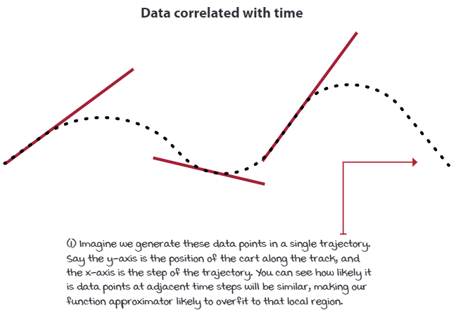

# 基于值的深度强化学习

[TOC]


## 对非深度学习方法章节总结

- 第2章，介绍了将问题表述成强化学习可以解决的马尔可夫决策过程

- 第3章，描述了解决MDP问题的策略迭代和值迭代算法，规划算法。

- 第4章，在没有MDP模型的条件下，解决单步MDP问题（依靠估计）。多臂赌博机处理估计回馈（evaluative feedback）

- 第5章，在序列和不确定环境下，如何估计策略的价值

- 第6章，在不确定的序列决策问题下，计算最优策略

- 第7章，学习了最大化利用经验，计算最右策略的方法

- 第5，6，7章处理了**同步序列(simultaneously sequential)**和**估计(evaluative)**的回馈问题,解决这种问题的强化学习方法通常被称为**表强化学习(tabular reinforcement learning)**

## 目前常见的强化学习方法类型

- 基于值(value-based)
- 基于策略(policy-based)
- 基于演员评论家(actor-critic)
- 基于模型(model-based)
- 无梯度方法(gradient-free / derivative-free)

## 深度强化学习智能体使用的回馈特点

|                                                     | sequential（vs. one-shot） | Evaluative(vs. supervised) | Sampled(vs. exhaustive) |
| --------------------------------------------------- | -------------------------- | -------------------------- | ----------------------- |
| Supervised learning                                 | $\times$                   | $\times$                   | $\checkmark$            |
| Planning (chapter3)                                 | $\checkmark$               | $\times$                   | $\times$                |
| Bandits (chapter4)                                  | $\times$                   | $\checkmark$               | $\times$                |
| Tabular reinforcement learning (chapters 5,6,7)     | $\checkmark$               | $\checkmark$               | $\times$                |
| Deep reinforcement learning (chapters 8,9,10,11,12) | $\checkmark$               | $\checkmark$               | $\checkmark$            |

### 回馈带有序列性

- 时序反馈中的信息延迟,延迟回馈导致解释反馈的来源变得棘手。例如棋类游戏可能只有到游戏的最后才能反应出之前行为的好坏。
- **时序反馈引发了时间信用分配问题**。也即需要确定奖励来自于哪个state，action或者state-action pair。
- **需要同时兼顾短期目标和长期收益**。

#### 相比于one-shot feedback

如监督学习或者多臂赌博机问题，其决策没有长期后果。决策和决策之间是独立的。

- 例如分类一个图像，不论分类是否正确都不会影响之后的表现。但在深度强化学习中，这种时序的依赖是存在的。
- 多臂赌博机，在执行一个动作后回合会**立即**结束。

### 回馈带有估计性

- 表强化学习(tabular reinforcement learning)和赌博机(bandits)都在处理带有估计的回馈。
- 带有估计的回馈的难点是，**回馈的好坏是相对的**。因为环境是不确定的。而环境不确定的原因是不能获取到环境的MDP，也即转移函数和奖励函数
- 需要平衡**探索新信息和利用已有知识**之间的关系。由于探索新信息，会导致错过对已有知识的利用机会。**容易累计错误**(accumulate regret)。 这都是由于不确定性导致的。
- **通过探索新信息，提升当前的信息。**

#### 相比于supervised feedback

- supervised feadback的模型会受到监督。在训练中，每个采样样本会被给与**正确的标签**，**如果模型计算错误，则正确的答案会在之后立即给与**。
- 由于有正确的答案，监督回馈比估计回馈更容易处理。
- 赌博机虽然不用处理序列回馈问题(其状态是单一的)，但是其需要从估计回馈中学习。需要平衡探索和利用的需求。
- 当回馈**既是估计的也是序列的**，问题会**更加困难**。因为算法必须同时平衡瞬时和长期目标，并且收集和利用信息。
- 表强化学习(tabular reinforcement learning)和DRL都能从时序序列(simultaneously sequential)和估计反馈中学习

### 回馈带有采样性

- 表强化学习和深度强化学习的区别在于处理问题的复杂度。
- 深度强化学习处理的问题往往不能**穷举**所有的反馈。智能体需要使用收集到的反馈进行归纳(generalize)，并在此基础上提出明智的决策。
- **并不是所有的问题都能穷举**,所以表强化学习有一定的局限性。
- 监督学习也是从采样的样本中学习。而表强化学习和多臂赌博机则不是。

#### 相比于穷举回馈

- 穷举意味着智能体要能获取到**所有**可能的样本
- 表强化学习和多臂赌博机只需要采集足够长时间的样本，为获取最优性能提供足够的信息。能采集到**穷举的回馈**也是表强化学习能收敛到最优的先提条件。（能用表格建模的环境往往符合这种假设）
- 当处理高维或者连续状态，动作空间时；或者当需要快速处理这些问题时，表格方法不能起作用。

## 强化学习函数逼近的介绍

deep learning $=$ "non linear function approximation"

函数毕竟主要为了在表强化学习的基础上，解决下面两种问题。

### 强化学习问题可能有高维的状态和动作空间

- 强化学习环境可能有着**高**或者**极高**的（状态空间或者动作空间）维度。这个维度单单指描述一个状态所需要的变量数量。例如一张彩色图像可以有$w*h*channel$个变量。
- 使用表强化学习，在实际的复杂问题中描述价值函数是不实际的。换句话说，表方法无法描述复杂度高的问题。

### 强化学习问题可能有着连续状态或动作空间

- 强化学习环境可能还有连续变量。以为着一个变量可以有无线多的值。例如身高1.7m~1.8m，区间内可以包含无数个值。
- **即便不是连续变量，一个变量也可能需要一个很高维度或者很大的数量来表示。例如一个像素可以取值0~255**
- 低维状态空间也可以是无穷大的状态空间。例如机器人(x，y，z)的连续值。
- **虽然可以利用离散化解决，但是效率往往不高**

### 使用函数逼近的优势

- 通过函数逼近，智能体可以更少的数据学习和利用范式(patterns),同时也许会更快。
- **表格(离散)方法**每个索引下的值是**独立的**，**函数逼近**可以展示数据间的**潜在关系**
- 基于上一条特点，**表格方法**一次更新只更新/改变**当前单一状态**；而**函数逼近**则可以更新/改变**多个状态**。

1. 规划方法(例如值迭代)和表强化学习方法(例如Q-learning)**不能**灵活的处理采样回馈问题使得这些方法在采样类问题上并不实际。
2. 缺乏归纳(generalization)使得规划方法和表强化学习缺乏效率。**这里的归纳强调的是数据间的联系。**

使用函数逼近的目的除了解决不能解决的问题(高复杂度)，还希望更高效的解决问题(依靠归纳)

## neural fitted Q(NFQ) iteration

可能是第一个成功使用神经网络作为函数逼近，解决强化学习问题的方法。

### 决策点一：选择需要近似的价值函数

#### 三种价值函数

1. 状态值函数 $v(s)$：状态值函数即时有很多用途，但是**不能独自**解决控制问题(contorl problem)。状态值函数可以计算出从状态s和之后使用策略$\pi$可以得到的期望折扣回报的大小。状态值函数不能决定智能体要采取的动作，**除非利用环境的MDP**去做单步预测。
2. 动作值函数 $q(s)$： 有能力解决控制问题(control problem)。 根据通用策略迭代范式，针对价值函数的估计方式的不同可以分为on-policy和off-policy。
3. 动作优势函数 $a(s,act)$：可用于比较来区分相同状态下不同动作的优势。**能更容易的反映出一个动作比平均水平好多少。**


*在深度强化学习中，$Q(s,a) \to Q(s,a;\theta)$ 表示$Q$的估计是由$\theta$来参数化的。*

说明：$\theta$表示神经网络的权重，$s$ 表示状态，$a$表示动作

### 决策点二：选择神经网络结构

1. $Network(state,action) \to Q_{value|state,action}$ 直接计算state,action的Q值。每个state下需要计算多个action的值。
2. $Network(state) \to Q_{value|state,a} a\in A$ 计算输出state下所有action的Q值。**这对于探索策略例如epsilon-greedy或者softmax有优势**。**因为对于任何给定的状态，只需要执行一次前向运算就能获得所有动作的值，提供了高的性能。而在有大量动作的环境中更是如此。**

*NFQ使用了第2中结构，即对网络输入**一个**state,获得**多个**action的Q值*

### 决策点三：选择优化目标

**假设**这是一个监督问题，则：
$$
L_{i}(\theta_{i}) = \mathbb{E}_{s,a}[(q_{*}(s,a) - Q(s,a;\theta_{i}))^2]
$$
其中：

1. $q_{*}(s,a)$表示最优动作值函数下s,a的**值**
2. $Q(s,a|\theta_{i})$当前$\theta_i$动作值函数下s,a的**值**
3. 小写$q$表示真值，大写$Q$表示估计.

**然而最优动作值函数$q_{*}(s,a)$是当前不可知的。但是可以通过通用策略迭代，即交替策略估计和策略提升过程去迭代好的策略。**

------

**回顾**最优动作值函数，也即在**最优策略**下，**每个**状态，动作都获得**最大期望回报**：
$$
q_{*}(s,a) = \max_{\pi}\mathbb{E}_{\pi}[G_t|S_t=s,A_t=a], \forall s \in S, \forall a \in A(s)
$$

------

然而，由于使用了**非线性函数逼近**(non-linear function approximation),**不能确保一定收敛。**

本书的NFQ实现思路。**交替估计一个策略(从该策略中采样行为)和提升策略(使用一个探索策略)** 

具体为：

1. 随机出是化动作值函数，也即隐含策略。
2. 通过从策略中采样动作估计策略。
3. 通过探索策略提高动作值函数 / 策略。
4. 不断迭代直到达到目标效果。

### 决策点四：选择策略估计的目标

- 有多种方式可以估计一个策略。具体的说一个策略$\pi$的动作价值函数估计可以有多种目标(targets)
  - monte-carlo target：利用一个轨迹从起始状态到中止状态的reward
  
  - temporal-difference target：利用下一状态的值估计当前的值（单步自举）
    - SARSA target
      $$
      y_{i}^{Sarsa} = R_{t+1} + \gamma Q(S_{t+1},A_{t+1};\theta_{i})
      $$
      **注：**对于**在线策略**，目标近似于行为策略(behavioral policy)。并且生成**行为策略**和**学习策略**是**相同**的。
    
    - Q-learning target
      $$
      y_{i}^{Q-learning} = R_{t+1} + \gamma \max_{a}Q(S_{t+1},a;\theta_{i})
      $$
      **注：**相比于**在线策略**，目标**总是**近似于贪婪策略(greedy policy)。**即使行为策略是非贪婪的。**
    
  - n-step target：多步自举
  
  - lambda target：利用lambda以指数衰减的方式混合n步目标为一个

- NFQ, Q-learning target

$$
y_{i}^{Q-learning} = R_{t+1} + \gamma \max_{a}Q(S_{t+1},a;\theta_{i})
$$

$$
L_{i}(\theta_{i}) = \mathbb{E}_{s,a,r,s'}[(r + \gamma \max_{a'}(s',a';\theta_{i})-Q(s,a;\theta_{i}))^2]
$$

$$
\nabla_{\theta_i}L_i(\theta_i) = \mathbb{E}_{s,a,r,s'}[(r+\gamma\max_{a'}Q(s',a';\theta_i)-Q(s,a;\theta_i))\nabla_{\theta_i}Q(s,a;\theta_i)]
$$

**注：**$r+\gamma\max_{a'}Q(s',a';\theta_i)$ **不包含在梯度计算之中**

```python
    def optimize_model(self, experiences):
        states, actions, rewards, next_states, is_terminals = experiences
        batch_size = len(is_terminals)
        # detach() 表示确保self.oneline_model一定不参与梯度计算，利用max获取最大的值。
        max_a_q_sp = self.online_model(next_states).detach().max(1)[0].unsqueeze(1)
        target_q_s = rewards + self.gamma * max_a_q_sp * (1 - is_terminals)
        q_sa = self.online_model(states).gather(1, actions)

        td_errors = target_q_s - q_sa # 计算loss
        value_loss = td_errors.pow(2).mul(0.5).mean()
        self.value_optimizer.zero_grad()
        value_loss.backward()
        self.value_optimizer.step()
```

#### 关注点

1. 确保只对预测值进行反向传播。就如同在监督学习中，**真值(标签)**通常是预先给定的**常量**；在**强化学习中**，“真值”来自于模型计算的预测值，是由模型计算而来。而对于这个“真值”需要使其成为**常量**，在pytorch中使用detach方法。**这里的常量指的是不参与反向传播的变量**。这对一个可靠强化学习算法的实现**相当重要**

2. 如何处理“终止状态”。终止状态的flag**强制**最终状态的价值**为0，**防止值函数偏离。

3. 在openAI的环境实现中，某些环境给定了一个固定的终止步长(steps)。例如CartPole-v0,默认在500步的时候会给一个terminal state。**这么做的目的使为了防止训练中智能体使用过长的时间完成一个回合。值得注意的是，这个时候返回的奖励是0。** 修改方法：

   1. 检测是否到达最大终止步长

   2. 检测info字典里的TimeLimit.truncated, 

      ```python
      new_state, reward, is_terminal, info = env.step(action)
      is_truncated ='TimeLimit.truncated'in info and \
      				info['TimeLimit.truncated']
      is_failure = is_terminal and not is_truncated
      experience =(state, action, reward, new_state,float(is_failure))
      ```

### 决策点五：选择探索策略

- 通用策略迭代模式
  - 策略估计
  - 策略策略——探索
- NFQ是一个Q-learning 演化的算法，因此其Q值估计使用的是off-policy方法。也即学习策略和行为策略是不同的。
  - 学习策略：greedy policy（an ultimately optimal policy)，单纯的求max
  - 行为策略：epsilon greedy policy
- 第6章(**简单，复杂度低且离散的环境**)所使用的可以是任何行为生成策略。只要该策略可以对所有state-action pair提供充足的探索。
- **训练（trainning）**中，NFQ使用epsilon-greedy 策略并以50%的概率随机探索。在**估计（evaluating）**中，使用greedy方法获取动作值函数对应的策略。

### 决策点六：选择损失函数

- 损失函数的作用是为了测量拟合结果的好坏
  - 监督学习
  - **强化学习中，真值的来源是网络预测的结果**
- 强化学习中的均值方差(MSE), 在NFQ中，
  - 预测值：神经网络直接预估的动作价值函数的值。即$value = Net(state_{current},action)$
  - 真实值：**实际只是理想值**，NFQ中根据Q-learning的方法，使用TD target作为真值。即${value_{ideal} = Net(next_{state}).max()}$

### 决策点七：选择优化方法

- 梯度下降(gradient descent)：
  - 数据必须是**独立同分布**（independent and identically distributed）并且**优化的对象需要是静态的**
  - 这点在强化学习中是**不能保证的。**
- batch gradient descent：
  - 使用整个数据集，梯度下降的稳定性最好
  - 缺点是**慢**
- mini batch gradient descent
  - 使用部分数据作为”小“数据集，通常batch size为32~1024
  - 缺点是稳定性差(batch size小的时候)，即**方差大**
  - batch size 为 1 时 为 **stochastic** gradient descent
  - batch size 为 dataset.size()时为 batch gradient descent
- momentum
  - gradient descent with momentum
    - 使用mini batch
    - 使用梯度移动的均值方向，而不是梯度本身。
    - 目的是为了减弱震荡，直接向着目标方向多移动一点。
  - root mean square propagation (RMSprop)
    - 使用mini batch
    - 按梯度幅度(magnitude)的均值比例缩放(scale)梯度
      - 以梯度平方的均值平方根为比例缩放梯度
      - 以最近梯度的平均幅度为比例缩放梯度。
    - 目的是为了减弱震荡，直接向着目标方向多移动一点。RMSprop可以动态的调节梯度大小
- adaptive moment esitmation
  - 使用梯度的速度方向，类似于momentum
  - 缩放更新梯度，类似于RMSprop
  - 是一个比RMSprop激进，比momentum柔和的优化方法。

- 优化方法会**影响**损失函数的最小化**收敛或者发散**
- 可以将损失函数看作一个有山峰，山谷和平面的山地。而优化方法的作用是一种寻找感兴趣区域的步行策略。在这个比喻里，至高或者至低点通常是感兴趣的区域。
- 强化学习中，推荐使用RMSprop 和 adam。但是**RMSprop对超参数的敏感性低，这点对值深度强化学习很重要**

### 当前方法的缺点

- 函数逼近可以从状态-动作对中归纳知识，但同时也说明**网络会立即更新网络所有相似状态的值。**

- 目标值是**非静态的**。 因为更新了动作值函数网络的权重，使得目标值也发生了更新(或者说移动)。使得最近的更新过期(失效了)。 这会导致**训练很快变得不稳定**。

- NFQ中只单纯的记录经验，当达到batch size的时候才训练并清除记录。导致采集的**数据过于关联**。这些数据中大多数来自同一个轨迹和策略。这说明网络学习的mini batch中的样本是相似的，而之后使用的mini batch同样有着内部关联，但是和之前的mini bath不同(随着时间的推移，网络学习的mini batch有着不同的数据意义，也即分布不同）。

- 强化学习问题”**独立同分布**“假设**不成立**。

  - 因为强化学习中，新的状态依赖于当前状态。
  - 潜在的数据生成过程(策略)是随着时间变化的。这意味这数据的分布本身就不是固定的。每次策略的变化，都会收到新且可能不同的经验。

    

- 虽然优化方法一定程度上放松了对独立同分布假设的要求，但是强化学习的问题超出了优化方法处理的能力。

  