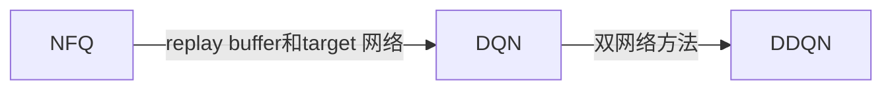

#  更稳定的基于值函数的方法

[TOC]

## DQN：让强化学习更像监督学习

### 值函数的强化学习的一些常见问题

**现有的优化方法依赖于独立同分布假设和静态优化目标假设。**

监督学习的数据符合上述假设。

与之相反，强化学习：

- 不能遵守独立同分布(IID)假设
- 不能有个静态(不变)的优化目标

#### 监督学习 vs. 强化学习

##### 监督学习

- **提前（advance)**获取到了一个数据集，将数据集预处理，**打乱**分离成小的数据集来训练
- **打乱**数据使得数据：
  - 避免发展出过拟合的偏差(bias)
  - 减少训练过程中的方差(variance)
  - 加速收敛(convergence)
  - 整体上，学习一个对**潜在数据生成过程**的更通用表达。
- 训练过程中，数据对应的目标值是**固定的。**

##### 强化学习

1. 违背独立同分布

- 相比于监督学习，数据是**在线(online)**收集的。导致了第t+1时刻生成的经验样本和第t时刻生成的经验样本是**相关的**。
- 当策略提升的时候，**策略的提升改变了潜在的数据生成过程**。这意味这新的数据是局部相关且不均匀分布的。（**目标改变导致数据的采样分布变化**）

2. 违背静态优化目标

- 目标会随着网络的更新发生**改变。**基于值函数的方法中，优化价值函数。因此价值函数的优化会影响价值函数的形状，进而影响目标的值。这意味这使用的目标至少是无效或者有偏差的。(**目标改变导致函数的值发生改变**)

##### 在NFQ中

- 通过使用batch训练
- 使用一个**固定的小数据集**迭代多次

1. 采集一个小数据集。
2. 计算目标。
3. 在下一次采样前，多次优化网络。

将上述过程放在一个大批量的采样数据中，网络更新是由遍布网络函数的多个点构成。这使得目标的变化**更稳定一些**。

### 使用目标网络

- 使用一个单独的目标网络。该网络在多个时间步中保持不变，计算一个**更稳定的目标值。**
- 通过目标网路来**保持目标值不变**，将问题从”chasing your own tail“转化成”人工将问题分解成多个小的监督问题，并将问题有序的展现给智能体。“
- 当固定目标网络时，目标网络会被保持多个时间步长。
- **这个方法提高了拟合的几率。**
- 但是并没有达到最优值，因为这在非线性函数逼近中是不存在的。然而，非线性函数往往能在**全局上收敛**。
- 该方法实质上减少了结果离散的机会。
- 能**更容易**的**区分相关状态**

#### 公式对比

$$
\nabla_{\theta_i}L_i(\theta_i) = \mathbb{E}_{s,a,r,s'}[(r+\gamma \max_{a}Q(s',a';\theta_i)-Q(s,a;\theta_i)) \nabla_{\theta_i}Q(s,a;\theta_I)]
$$

$$
\nabla_{\theta_i}L_i(\theta_i) = \mathbb{E}_{s,a,r,s'}[(r+\gamma \max_{a}Q(s',a';\theta^{-})-Q(s,a;\theta_i)) \nabla_{\theta_i}Q(s,a;\theta_I)]
$$

公式（2）中$\max_{a}Q(s',a';\theta^{-})$表示一个一段时间之前网络的实例。这个实例被“冻结”了多个时间步长。这让梯度更新有时间去优化目标网络。使网路的学习更稳定。

#### 注意

- **目标网路**和**在线网络**是**网络权重的两个实例**:
  - 它们有着相同的网络结构。
  - 周期(按频率)更新目标网络，使目标网络能“匹配上”在线网络的权重。
  - 在线网络随着每个时间步更新。
- 目标网络的更新频率是根据实际问题决定的。
  - 10~1000个time step比较常见
  - 卷据图像网络 > 10,000 time steps比较常见
  - 简单直接的问题，例如cart-pole，10~20 time steps
- 虽然目标网络稳定了训练的目标值，但是**减慢了训练速度**

### 使用更大的网络

- **某种程度上**，另一种解决非静态问题的方法是使用更大的网络。
- 使用更大的网络更有可能检测出输入之间的**细微差别**
  - 更大的网络能够减少状态-动作对之间的混叠
    - 这里的混叠指的是，当两个状态**可以**看起来相同或者相似，但**实际**需要不同的动作。
    - 状态的混叠会发生在网络缺乏表达能力的时候。毕竟神经网络试图找到相似性来归纳(find similarities to generalize)。神经网络的目标是找到这些相似性。
    - 然而神经网络**过小**，会导致归纳出错。神经网络会倾向于简单，容易发现的规范。
  - 网络能力越强则混叠越少，混叠越少连续样本之间的相关性就不太明显。
  - 所以目标值和当前估计值之间看起来越独立。
- **但是**，需要**更长**的时间训练。
  - 更多的数据(需要更长的交互时间)
  - 更长的计算(处理)时间
- 相比更大的网络，使用目标网络是一种**更具鲁棒性**的方法。

### 目标网络 vs. 更大的网络

- 目标网络方法更具有鲁棒性。**创建了一个临时的静态目标。**

- 两种属性对最终性能有着相似的影响。**可以“看出”相似状态(比如，那些暂时相关的状态)下的不同之处。**

  - 网络的尺寸																											

  - 目标网络和网络的更新频率

- 目标网络方式被**多次证明是有效的**

- 大网络方法**不是永远奏效**

### 使用经验回放

- 由一个数据结构组成。这个数据结构通常被称为回放缓存(replay buffer or replay memory)

- 经验回放内会存放多个时间步长的数据样本(历史经验)。

- 经验回放允许从大量过去的经验中采样 mini-batches
  - 智能体的训练可以使用**更加**不同的mini-bathes(从回放中采样)来更新网络
  - 不需要对一个mini-bathes反复迭代多次(相比于NFQ而言)
  - 充分采样一个足够大的回放缓存，会使目标值智能**缓慢**的优化。所以通过回放机制每一个时间步下都可以采样和训练。并且结果偏离的风险很小。
  
- 经验回放的优点：
  - 通过**随机**从回放中采样，提高了低方差优化网络的概率(网络更新更稳定)
    - NFQ中，多数样本是**相关且相似**的。这样的样本使得**函数的变化集中在有限的区域。** 这潜在的**过分强调(overemphasize)**了更新的幅度(不稳定)。
    - 相反如果均匀地随机从回放中采样，由于样本很大可能是分布在各个区域，使得更新也分布在各个区域。能**更好**的表现**真实的价值函数**。
  - 经验回放使数据**看起来**更符合独立同分布，所以优化方法会更稳定。因为一个mini-batch的数据是一次性从多个轨迹，甚至策略中采样得到的。
  - 通常，一个回放缓存的容量在10,000~1,000,000个经验。取决于问题。一旦超过最大值时在插入新经验之前，将会释放**最老的经验**。
  - **但是，**高维的观测数据(例如图像或者多张图像)需要更大的缓存空间，进而可能很快达到**硬件**缓存空间的**限制**
  
  $$
  \nabla_{\theta_i}L_i(\theta_i) = \mathbb{E}_{s,a,r,s'}[(r+\gamma \max_{a}Q(s',a';\theta^{-})-Q(s,a;\theta_i)) \nabla_{\theta_i}Q(s,a;\theta_I)]
  $$
  
  $$
  \nabla_{\theta_i}L_i(\theta_i) = \mathbb{E}_{s,a,r,s' \sim \mathcal u(\mathcal D)}[(r+\gamma \max_{a}Q(s',a';\theta^{-})-Q(s,a;\theta_i)) \nabla_{\theta_i}Q(s,a;\theta_I)]
  $$
  
  注：
  
  1. $\mathcal u$指均匀采样，$\mathcal{D}$指回放缓存。**采样的方法可以由多种分布可选。**
  2. 公式(4)为整个DQN网络更新梯度。这被称为nature DQN(目标网络+经验回放)

### 使用其他的经验探索策略

- NFQ中使用了$\epsilon-greedy$探索策略：
  - **均匀**随机从0~1生成一个数number
  - 如果number < $\epsilon$, 则用**均匀分布**随机生成一个动作(这个随机动作可能包含贪婪推测出来的动作)
  - 如果number > $\epsilon$, 则使用贪婪动作。

```python
  class EGreedyStrategy():
      def __init__(self, epsilon=0.1):
          self.epsilon = epsilon
          self.exploratory_action_taken = None
  
      def select_action(self, model, state):
          self.exploratory_action_taken = False
          with torch.no_grad():
              q_values = model(state).cpu().detach().data.numpy().squeeze()
  
          if np.random.rand() > self.epsilon:
              action = np.argmax(q_values)
          else: 
              action = np.random.randint(len(q_values))
  
          self.exploratory_action_taken = action != np.argmax(q_values)
          return action
```

- 线性$\epsilon-greedy$探索策略

```python
class EGreedyLinearStrategy():
    def __init__(self, init_epsilon=1.0, min_epsilon=0.1, decay_steps=20000):
        self.t = 0
        self.epsilon = init_epsilon
        self.init_epsilon = init_epsilon
        self.min_epsilon = min_epsilon
        self.decay_steps = decay_steps
        self.exploratory_action_taken = None
        
    def _epsilon_update(self):
        epsilon = 1 - self.t / self.decay_steps
        epsilon = (self.init_epsilon - self.min_epsilon) * epsilon + self.min_epsilon
        epsilon = np.clip(epsilon, self.min_epsilon, self.init_epsilon)
        self.t += 1
        return epsilon

    def select_action(self, model, state):
        self.exploratory_action_taken = False
        with torch.no_grad():
            q_values = model(state).cpu().detach().data.numpy().squeeze()

        if np.random.rand() > self.epsilon:
            action = np.argmax(q_values)
        else: 
            action = np.random.randint(len(q_values))

        self.epsilon = self._epsilon_update()
        self.exploratory_action_taken = action != np.argmax(q_values)
        return action
```


- 指数$\epsilon-greedy$探索策略

```python
class EGreedyExpStrategy():
    def __init__(self, init_epsilon=1.0, min_epsilon=0.1, decay_steps=20000):
        self.epsilon = init_epsilon
        self.init_epsilon = init_epsilon
        self.decay_steps = decay_steps
        self.min_epsilon = min_epsilon
        self.epsilons = 0.01 / np.logspace(-2, 0, decay_steps, endpoint=False) - 0.01
        self.epsilons = self.epsilons * (init_epsilon - min_epsilon) + min_epsilon
        self.t = 0
        self.exploratory_action_taken = None

    def _epsilon_update(self):
        self.epsilon = self.min_epsilon if self.t >= self.decay_steps else self.epsilons[self.t]
        self.t += 1
        return self.epsilon

    def select_action(self, model, state):
        self.exploratory_action_taken = False
        with torch.no_grad():
            q_values = model(state).detach().cpu().data.numpy().squeeze()

        if np.random.rand() > self.epsilon:
            action = np.argmax(q_values)
        else:
            action = np.random.randint(len(q_values))

        self._epsilon_update()
        self.exploratory_action_taken = action != np.argmax(q_values)
        return action
```

- soft-max探索策略

```python
class SoftMaxStrategy():
    def __init__(self, 
                 init_temp=1.0, 
                 min_temp=0.3, 
                 exploration_ratio=0.8, 
                 max_steps=25000):
        self.t = 0
        self.init_temp = init_temp
        self.exploration_ratio = exploration_ratio
        self.min_temp = min_temp
        self.max_steps = max_steps
        self.exploratory_action_taken = None
        
    def _update_temp(self):
        temp = 1 - self.t / (self.max_steps * self.exploration_ratio)
        temp = (self.init_temp - self.min_temp) * temp + self.min_temp
        temp = np.clip(temp, self.min_temp, self.init_temp)
        self.t += 1
        return temp

    def select_action(self, model, state):
        self.exploratory_action_taken = False
        temp = self._update_temp()

        with torch.no_grad():
            q_values = model(state).cpu().detach().data.numpy().squeeze()
            scaled_qs = q_values/temp
            norm_qs = scaled_qs - scaled_qs.max()            
            e = np.exp(norm_qs)
            probs = e / np.sum(e)
            assert np.isclose(probs.sum(), 1.0)

        action = np.random.choice(np.arange(len(probs)), size=1, p=probs)[0]
        self.exploratory_action_taken = action != np.argmax(q_values)
        return action
```


#### DQN主要过程

> - 近似动作值函数$Q(s,a;\theta)$
> - 使用state-in-**values**-out 结构(输出节点的数量对应动作数量，表示每个state-action的值)方便比较动作值的大小（如果使用state-in-**value**-out 结构则不好比较不同动作的值）
> - 向着最优动作值函数$q^*(s,a)$优化动作值函数。
> - 使用离线策略的TD targets(Q-learning)去估计策略值。$r + \gamma * \max \limits_{a'} Q(s',a';\theta)$
> - 使用均方差(mse)作为损失函数。
> - 使用RMSprop左右优化器，学习速率为0.0005
> - 使用exponentially decaying epsilon-greedy来提高策略。通多大约20,000步，epsilon从1.0衰减到0.3。
> - 每15步完全(fully)更新一次目标网络
>
> 主要环节：
>
> 1. 采集经验元组$(s_t,A_t,R_{t+1},S_{t+1},D_{t+1})$ 并将经验插入到回放缓存中。
> 2. 随机从缓存中通过**均匀分布采样**一个mini-batch，为所有mini-batch内的经验计算离线 TD targets(Q-learning)
> 3. 利用MSE和RMSProp拟合动作值函数。

## Double DQN: 缓解高估动作值函数

核心思路：将DQN中的Q-learning 改进为 double Q-learning。

相比于朴素DQN有着更好的性能表现。

- 网络的估计值可能会高于或者低于true value，所以估计值实际是偏离的。而DQN永远对估计值取max的操作，导致网络容易高估值的大小。这导致算法出现了积极性偏向，从而影响了性能。

### 将动作选择从 动作估计中分离

- 将求max和argmax分解开：

$$
\nabla_{\theta_i}L_i(\theta_i) = \mathbb{E}_{(s,a,r,s') \sim \mathcal{u(D)}}[(r+\gamma \max \limits_{a'}Q(s',a';\theta^-)-Q(s,a;\theta_i)) \nabla Q(s,a;\theta_i)]
$$

$$
\nabla_{\theta_i}L_i(\theta_i) = \mathbb{E}_{(s,a,r,s') \sim \mathcal{u(D)}}[(r+\gamma Q(s',\arg \max \limits_{a'}Q(s',a';\theta^-);\theta^-) -Q(s,a;\theta_i)) \nabla Q(s,a;\theta_i)]
$$

- 公式(6)中实际将公式(5)分解为了两步：
  1. 先计算最优价值对应的动作
  2. 再计算这个动作对应的最优值
- 在公式(6)中，**两步使用的是同一个Q函数(target网络)，导致了偏差向着同一个方向**。
- 解决办法：使用double learning(两个动作值函数的实例)，一个用来估计最大动作值的下标(**动作**)，一个用来估计**该下标对应动作**的**最大动作值**。

### 解决方法

- **双网络过程**
  - 两个动作值函数，$Q_A，Q_B$
  - 通过均匀随机，决定更新$Q_A$或者$Q_B$
  - 如果更新$Q_A$，$Q_A$函数生成动作，$Q_B$估计目标值
  - 如果更新$Q_B$，。$Q_B$函数生成动作，$Q_A$函数估计目标值
- **直接使用双网络方法效果可能比不使用双网络方法好**，**但**直接使用双网络方法在DQN中会导致：
  - 四个网络：两个目标网络，两个训练网络。
  - 减慢训练速度：一次只能训练优化四个网络中的一个。

### 更实际双网络解决方法

- 思路：直接使用target网络和online网络构建双网络架构。并且在训练中只训练online网络，使用target网络来辅助交叉验证估计(某种层面上)
- 注意点：需要**小心**哪个网络作为动作选择，哪个网络作为动作估计。
  - 由于一开始的算法设计中。通过避免学习向着变动的目标移动，target网络稳定了训练。
  - 为了维护上一条，所以我们需要**使用online选择动作**，**target做选择的动作的估计**（指定状态下）。
  - 解释：如果反过来，使用online做估计，则因为online更新的频率比较高，使得网络的**值**变化是**持续的（不稳定）**。
- 公式（注意argmax里$\theta$的符号）：

$$
\nabla_{\theta_i}L_i(\theta_i) = \mathbb{E}_{(s,a,r,s') \sim \mathcal{u(D)}}[(r+\gamma Q(s',\arg \max \limits_{a'}Q(s',a';\theta^-);\theta^-) -Q(s,a;\theta_i)) \nabla Q(s,a;\theta_i)]
$$

$$
\nabla_{\theta_i}L_i(\theta_i) = \mathbb{E}_{(s,a,r,s') \sim \mathcal{u(D)}}[(r+\gamma Q(s',\arg \max \limits_{a'}Q(s',a';\theta_i);\theta^-) -Q(s,a;\theta_i)) \nabla Q(s,a;\theta_i)]
$$

- DQN和DDQN代码对比

1. DQN

```python
def optimize_model(self, experiences):
        states, actions, rewards, next_states, is_terminals = experiences
        batch_size = len(is_terminals)
        
        max_a_q_sp = self.target_model(next_states).detach().max(1)[0].unsqueeze(1)
        target_q_sa = rewards + (self.gamma * max_a_q_sp * (1 - is_terminals))
        q_sa = self.online_model(states).gather(1, actions)

        td_error = q_sa - target_q_sa
        value_loss = td_error.pow(2).mul(0.5).mean()
        print(value_loss.size())
        self.value_optimizer.zero_grad()
        value_loss.backward()
        self.value_optimizer.step()
```

2. Double DQN（注意code 8~9）

```python
def optimize_model(self, experiences):
        states, actions, rewards, next_states, is_terminals = experiences
        batch_size = len(is_terminals)
        
        # argmax_a_q_sp = self.target_model(next_states).max(1)[1]
        argmax_a_q_sp = self.online_model(next_states).max(1)[1]
        q_sp = self.target_model(next_states).detach()
        max_a_q_sp = q_sp[
            np.arange(batch_size), argmax_a_q_sp].unsqueeze(1)
        target_q_sa = rewards + (self.gamma * max_a_q_sp * (1 - is_terminals))
        q_sa = self.online_model(states).gather(1, actions)

        td_error = q_sa - target_q_sa # loss = predict - true
        value_loss = td_error.pow(2).mul(0.5).mean()
        self.value_optimizer.zero_grad()
        value_loss.backward()        
        torch.nn.utils.clip_grad_norm_(self.online_model.parameters(), 
                                       self.max_gradient_norm)
        self.value_optimizer.step()
```

### 使用更宽容的损失函数

- 相比于小误差，MSE(mean square error)对**大误差有着更大的惩罚（梯度变化越大）。**
  - 在监督学习用，由于true value是**一开始就给定的且准确的**。所以当出现错误时，越大的错误给与越大的惩罚是合理的。
  - 强化学习中，由于没有true value的存在，并且value的大小取决于智能体滋生学习和估计。另外，算法假定的目标(target value)是持续变动的。即时使用target 网络方法，目标依然会经常变动。这些，导致了MSE其实不是和强化学习。
- 强化学习需要一个可以**平等对待不同大小误差**的损失函数，目的是**防止梯度过大。**
- MAE(mean absolute error)给**不同的误差相同的惩罚(梯度)**，使学习更稳定。
- **当误差接近于0时，MSE能更容易接近最优值。**
- **Huber loss 结合了MAE和MSE的特点**，在误差接近0的区域是二次的，超过某个阈值时为线性的。
  - 对离群loss由较好的鲁棒性
  - 在loss=0处可微
  - 阈值为$\delta$
    - 一般$\delta = 1 $
    -  当$\delta = 0$: Huber loss 就是MAE
    - 当$\delta = \infin$: Huber loss 就是MSE
  - 两种实现方式:
    - 按照定义实现，缺点是有些框架没有提供修改$\delta$（默认为1）的接口。**而$\delta = 1$不总是有效**。
    - 该实现更灵活，又被称为损失剪裁(loss clipping)或者梯度剪裁(gradient clipping)。具体方法是：
      1. 计算MSE
      2. 当梯度大于某一阈值时使用**固定的幅度值**(magnitude value)。
  - **注意和奖励剪裁(reward clipping)区别开。同时也不要将两者和Q值裁剪混淆。**
  - code 第17行

```python
def optimize_model(self, experiences):
        states, actions, rewards, next_states, is_terminals = experiences
        batch_size = len(is_terminals)
        
        # argmax_a_q_sp = self.target_model(next_states).max(1)[1]
        argmax_a_q_sp = self.online_model(next_states).max(1)[1]
        q_sp = self.target_model(next_states).detach()
        max_a_q_sp = q_sp[
            np.arange(batch_size), argmax_a_q_sp].unsqueeze(1)
        target_q_sa = rewards + (self.gamma * max_a_q_sp * (1 - is_terminals))
        q_sa = self.online_model(states).gather(1, actions)

        td_error = q_sa - target_q_sa # loss = predict - true
        value_loss = td_error.pow(2).mul(0.5).mean()
        self.value_optimizer.zero_grad()
        value_loss.backward()        
        torch.nn.utils.clip_grad_norm_(self.online_model.parameters(), 
                                       self.max_gradient_norm)
        self.value_optimizer.step()
```


#### DDQN的主要过程

> DDQN：
>
> - 近似动作值函数$Q(s,a;\theta)$
> - 使用state-in-**values**-out 结构(输出节点的数量对应动作数量，表示每个state-action的值)方便比较动作值的大小（如果使用state-in-**value**-out 结构则不好比较不同动作的值）
> - 向着最优动作值函数$q^*(s,a)$优化动作值函数。
> - 使用离线策略的TD targets(Q-learning)去估计策略值。$(r+\gamma Q(s',\arg \max \limits_{a'}Q(s',a';\theta_i);\theta^-)$
>
> - **使用Huber Loss（可选或者可以设置为MSE）**
> - **RMSProp，学习速率0.0007。在双网络学习方法中，学习速率偏大一点可能有更好的效果**
> - 使用exponentially decaying epsilon-greedy来提高策略。通多大约20,000步，epsilon从1.0衰减到0.3。
> - 回放缓存**最小**320个样本，**最大**50,000个样本。mini-batch大小64。
> - 每15步完全(fully)更新一次目标网络
> - 主要环节：
>
>   1. 采集经验元组$(s_t,A_t,R_{t+1},S_{t+1},D_{t+1})$ 并将经验插入到回放缓存中。
>   2. 随机从缓存中通过**均匀分布采样**一个mini-batch，为所有mini-batch内的经验计算离线 TD targets(Q-learning)
>   3. 利用MSE和RMSProp拟合动作值函数。




### 一些还能提高的环节

**当前的基于值函数的深度强化学习方法还不完美，但是足够可靠。**

- 当前的state-in-values-out结构使得强化学习接近监督学习，但是这个可以换个设想使方法更符合强化学习。例如可以拟合别的价值函数，使网络数据利用更充分。
  - dueling network

- 当前使用uniform对回放缓存采样，应当有更有效的方法。
  - prioritized experience replay


