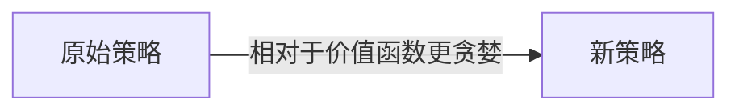

# 预测问题（Prediction problem）
- 指**估计策略**或者说**估计给定策略的价值函数**的问题
- 这里的估计价值函数就是为了学习预测回报（learning to predict returns）
- 状态价值函数从状态中估计期望回报
- 动作价值函数从**状态-动作对（state-action pair）**中估计期望回报
# 控制问题（Control problem）
- 指**寻找（find）**最优策略的问题,注意是**寻找**
- 控制问题通常还是利用GPI（generalized policy iteration）的范式解决。即策略评估和策略改进的竞争过程使策略逐步朝着最优的方向发展。（竞争过程可能指的是迭代最优的过程。）
- 相比于控制方法，RL方法通常将**动作价值函数**与**策略提升和动作选择策略**成对出现。

# 策略估计（Policy evaluation）
- 指解决预测问题的算法。
- 动态编程也有个policy evaluation的同名方法，但这个术语同样指解决所有预测问题的算法。

# 策略提升（Policy improvement）
- 指生成新的策略，且该新策略是通过使原策略（相较于原策略）更贪婪而提高原始策略获得。这里的更贪婪是就原始策略的价值函数而言的。
- 需要注意的是，策略提升自身并没有解决控制问题。通常控制问题是由策略估计和策略提升配对解决的（详见前控制问题）
- 策略提升仅仅指在给定策略估计结果的前提下，通过计算提高一个策略。

# 总结
- 预测问题指的是估计一个策略的一类问题。
- 控制问题指的是寻找到最优策略的一类问题。
- 策略估计是为了解决预测问题的方法。
- 策略估计和策略是解决控制问题的方法。